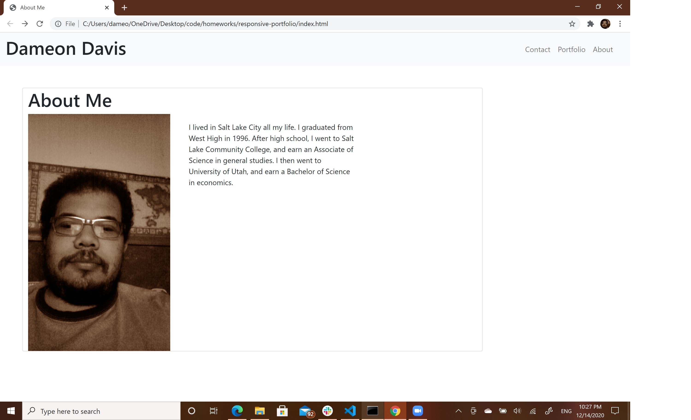

# responsive-portfolio
# user story
I want to make a website that responsive to the size of screen the website is display on. 
# Criteria
* make an index, contact, and portfolio
* add a navbar
* add personal information
* make item in website responsive using bootstrap
Project website: https://dad1977ut.github.io/responsive-portfolio/
Project repository: https://github.com/dad1977ut/responsive-portfolio

